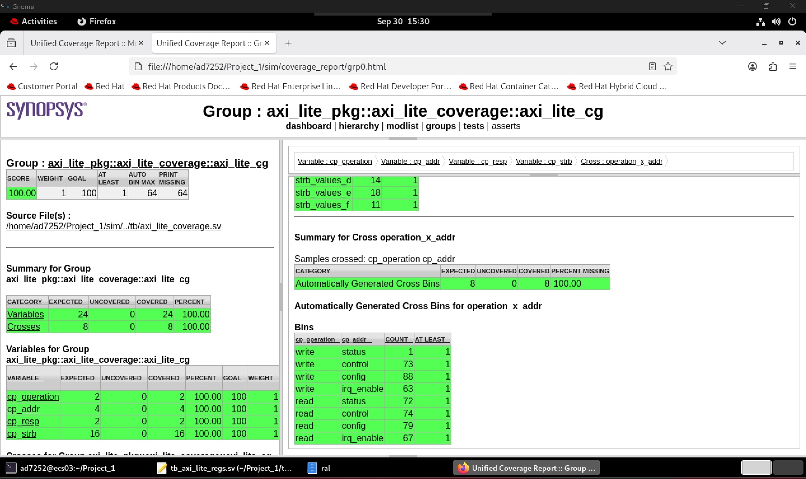
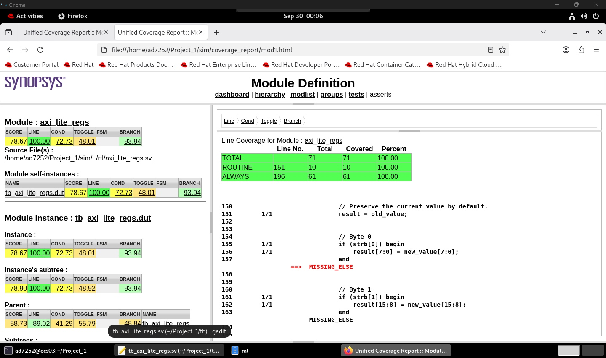
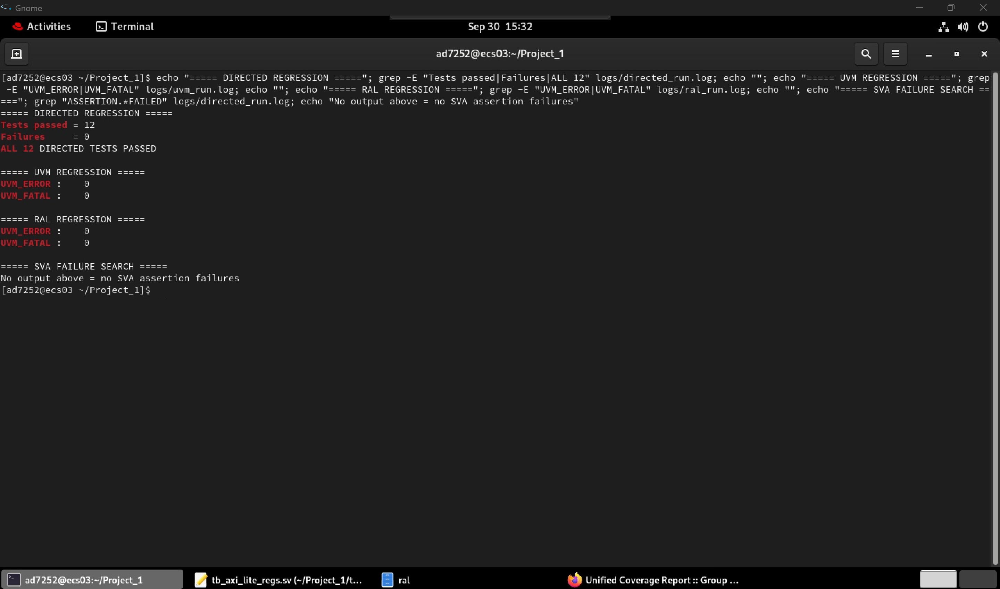

# AXI4-Lite Register Block Verification using SystemVerilog and UVM

A complete verification environment for a **32-bit AXI4-Lite register block**, developed using **SystemVerilog, UVM, SVA, UVM RAL, constrained-random verification, functional coverage, and Synopsys VCS/URG**.

The project verifies AXI4-Lite protocol behavior, register functionality, error responses, byte-write strobes, channel ordering, backpressure, reset recovery, and register-model behavior using both directed and UVM-based verification.

---

## Verification Results

| Metric | Result |
|---|---:|
| Directed tests | **12 / 12 passed** |
| UVM errors | **0** |
| UVM fatals | **0** |
| RAL errors | **0** |
| RAL fatals | **0** |
| SVA failures | **0** |
| Modeled functional coverage | **100%** |
| DUT line coverage | **100%** |
| DUT branch coverage | **93.94%** |
| DUT condition coverage | **72.73%** |
| DUT toggle coverage | **48.01%** |

> **Note:** 100% functional coverage refers specifically to all bins and crosses defined in this project's functional coverage model. It does not imply exhaustive verification of every possible AXI4-Lite behavior.

---

## DUT Overview

The DUT implements a **32-bit AXI4-Lite slave register block** with four memory-mapped registers.

| Address | Register | Access | Description |
|---|---|---|---|
| `0x00` | CONTROL | R/W | Bit 0 is a self-clearing START bit |
| `0x04` | STATUS | R/O | BUSY, DONE, and ERROR status |
| `0x08` | CONFIG | R/W | 32-bit configuration register |
| `0x0C` | IRQ_ENABLE | R/W | 32-bit interrupt-enable register |

### STATUS Register

| Bit | Field |
|---|---|
| `[0]` | BUSY |
| `[1]` | DONE |
| `[2]` | ERROR |
| `[31:3]` | Reserved / zero |

Writing `START = 1` begins a modeled operation.

The DUT:

- asserts `BUSY`
- automatically clears the START bit
- executes the modeled operation
- deasserts `BUSY`
- asserts `DONE`

Writes to the read-only STATUS register and accesses to unsupported addresses return an AXI4-Lite `SLVERR`.

---

## AXI4-Lite Interface

The design implements the five AXI4-Lite channels:

### Write Address Channel

```text
AWADDR
AWVALID
AWREADY
```

### Write Data Channel

```text
WDATA
WSTRB
WVALID
WREADY
```

### Write Response Channel

```text
BRESP
BVALID
BREADY
```

### Read Address Channel

```text
ARADDR
ARVALID
ARREADY
```

### Read Data Channel

```text
RDATA
RRESP
RVALID
RREADY
```

A transfer occurs when `VALID` and `READY` are both asserted on a rising clock edge.

The implementation supports independent write-address and write-data arrival, allowing both **AW-before-W** and **W-before-AW** transactions.

---

## Verification Architecture

The UVM environment follows a standard layered architecture:

```text
                    +------------------+
                    |       Test       |
                    +--------+---------+
                             |
                             v
                    +------------------+
                    |     Sequence     |
                    +--------+---------+
                             |
                             v
                    +------------------+
                    |    Sequencer     |
                    +--------+---------+
                             |
                             v
                    +------------------+
                    |      Driver      |
                    +--------+---------+
                             |
                             v
+-------------------------------------------------------+
|                  AXI4-Lite Interface                  |
+---------------------------+---------------------------+
                            |
                            v
                    +------------------+
                    |       DUT        |
                    +------------------+
                            |
                            v
                    +------------------+
                    |     Monitor      |
                    +--------+---------+
                             |
              +--------------+--------------+
              |                             |
              v                             v
     +------------------+          +------------------+
     |    Scoreboard    |          | Functional Cov.  |
     +------------------+          +------------------+
              |
              v
     +------------------+
     | RAL Predictor    |
     +------------------+
```

---

## UVM Components

### Sequence Item

`axi_lite_seq_item` represents AXI4-Lite transactions and contains:

- operation type
- address
- write data
- write strobe
- response

The transaction supports both `AXI_READ` and `AXI_WRITE` operations.

---

### Sequences

The environment includes:

- smoke testing
- constrained-random traffic
- negative/error testing
- WSTRB coverage closure
- RAL-based register testing

Random transactions are constrained to valid register addresses during normal traffic.

Dedicated negative sequences intentionally exercise illegal operations such as:

- writing to STATUS
- writing to an invalid address
- reading from an invalid address

---

### Driver

The driver converts transaction-level sequence items into AXI4-Lite signal activity.

It handles:

- write-address handshakes
- write-data handshakes
- write responses
- read-address handshakes
- read responses

The implementation respects AXI4-Lite `VALID/READY` timing requirements.

---

### Monitor

The monitor passively observes AXI4-Lite activity and reconstructs completed transactions.

Observed transactions are published through a UVM analysis port to:

- the scoreboard
- functional coverage
- the RAL predictor

---

### Scoreboard

The scoreboard maintains a reference model of expected register state.

It verifies:

- CONFIG writes and reads
- IRQ_ENABLE writes and reads
- byte-enabled writes
- read-only STATUS behavior
- invalid-address responses
- expected AXI4-Lite response values

Observed DUT behavior is compared against the predicted state.

---

### Agent

The AXI4-Lite agent encapsulates:

```text
Sequencer
Driver
Monitor
```

The agent provides the reusable protocol-level verification component used by the environment.

---

## UVM Register Abstraction Layer

A UVM RAL model is included for the register block.

The model represents:

```text
CONTROL
STATUS
CONFIG
IRQ_ENABLE
```

with their corresponding addresses and access policies.

### Register Map

```text
0x00  CONTROL       RW
0x04  STATUS        RO
0x08  CONFIG        RW
0x0C  IRQ_ENABLE    RW
```

The RAL implementation includes:

- `uvm_reg` register classes
- register fields
- address-map construction
- AXI4-Lite register adapter
- front-door register accesses
- register prediction
- mirrored-value checking

A `uvm_reg_predictor` receives transactions from the AXI4-Lite monitor and updates the register model based on observed DUT activity.

---

## SystemVerilog Assertions

The project contains **12 SVA properties** covering protocol and DUT behavior.

Checks include:

- `BVALID` stability under backpressure
- `RVALID` stability under backpressure
- AW channel stability
- W channel stability
- AR channel stability
- write-response generation
- read-response generation
- reset behavior
- START-to-BUSY behavior
- START self-clear behavior
- BUSY-to-DONE behavior
- DONE/BUSY consistency

The final regression completed with **no SVA assertion failures**.

---

## Directed Verification

The directed testbench contains **12 targeted tests**.

| Test | Scenario |
|---:|---|
| 1 | CONFIG write/read |
| 2 | IRQ_ENABLE write/read |
| 3 | Partial write using WSTRB |
| 4 | Invalid-address write |
| 5 | Invalid-address read |
| 6 | START → BUSY → DONE and START self-clear |
| 7 | STATUS read-only protection |
| 8 | Write data before write address |
| 9 | Write address before delayed write data |
| 10 | Write-response backpressure |
| 11 | Read-data backpressure |
| 12 | Reset and recovery |

Final result:

```text
Tests passed = 12
Failures     = 0

ALL 12 DIRECTED TESTS PASSED
```

---

## Constrained-Random Verification

The UVM environment generates constrained-random AXI4-Lite transactions across the register map.

Randomization covers:

- read/write operations
- register addresses
- write data
- write strobes

Targeted sequences supplement random testing for scenarios that are inefficient to reach purely through random stimulus.

This includes:

- `SLVERR` responses
- STATUS write attempts
- invalid addresses
- all 16 possible `WSTRB` values

---

## Functional Coverage

The functional coverage model tracks:

- operation type
- register address
- AXI response
- all 16 WSTRB combinations
- operation × address cross coverage

Final modeled functional coverage:

**100%**

All defined coverpoints and cross bins were covered:

```text
Operation bins       : 2 / 2
Address bins         : 4 / 4
Response bins        : 2 / 2
WSTRB bins           : 16 / 16
Operation × Address  : 8 / 8
```



---

## DUT Code Coverage

Synopsys VCS/URG was used to collect structural code coverage for the DUT.

Final DUT results:

| Coverage Type | Result |
|---|---:|
| Line | **100.00%** |
| Branch | **93.94%** |
| Condition | **72.73%** |
| Toggle | **48.01%** |

All **71/71 DUT executable lines** were covered.



The lower condition and toggle percentages were retained rather than artificially increasing them with stimulus that could violate the intended AXI4-Lite transaction semantics.

This distinction is important because verification closure should preserve protocol correctness rather than optimize a coverage number in isolation.

---

## Regression Automation

The project includes a `tcsh` regression script:

```text
scripts/run_regression.csh
```

The regression flow:

1. removes stale simulation artifacts
2. compiles the directed testbench
3. runs directed verification
4. collects directed code coverage
5. compiles the UVM environment
6. runs constrained-random and targeted UVM verification
7. collects UVM code coverage
8. merges coverage databases using URG
9. runs the dedicated RAL test

Final regression status:

```text
DIRECTED
Tests passed = 12
Failures     = 0
ALL 12 DIRECTED TESTS PASSED

UVM
UVM_ERROR : 0
UVM_FATAL : 0

RAL
UVM_ERROR : 0
UVM_FATAL : 0

SVA
No assertion failures
```



---

## Debugging Highlights

Several issues encountered during development provided useful verification/debugging experience.

### AXI Driver Timing

Early UVM driver behavior exposed timing issues around `VALID/READY` handshakes.

The driver was updated to:

- drive protocol signals before the sampling edge
- sample handshakes on the active clock edge
- deassert signals only after confirmed handshakes

This reinforced the distinction between transaction-level intent and cycle-accurate protocol behavior.

### Independent AW/W Channels

The DUT captures write address and write data independently.

Directed tests explicitly verify:

```text
AW first → delayed W
W first  → delayed AW
```

ensuring the implementation does not incorrectly assume simultaneous channel arrival.

### Backpressure

Dedicated tests hold:

```text
BREADY = 0
```

and:

```text
RREADY = 0
```

to verify that the DUT correctly maintains response information until the receiver accepts the transaction.

### Coverage Closure

Initial functional coverage exposed missing response and WSTRB scenarios.

Instead of simply increasing random transaction count, targeted sequences were added for:

- error responses
- read-only register writes
- all WSTRB combinations

This closed all modeled functional coverage bins.

### Coverage vs. Protocol Correctness

Additional stimulus was experimentally evaluated to improve condition coverage.

SVA detected that the stimulus could create misleading post-handshake `VALID` behavior. The stimulus was rejected and the clean protocol-correct regression was retained.

This left final DUT condition coverage at **72.73%**, while maintaining zero assertion failures.

### Regression Reproducibility

Stale VCS incremental-build artifacts initially caused simulations to execute outdated compiled behavior.

The regression script now removes previous executables, `.daidir` directories, and coverage databases before recompilation.

---

## Project Structure

```text
.
├── assertions/
│   └── axi_lite_assertions.sv
│
├── docs/
│   └── images/
│       ├── dut_code_coverage.png
│       ├── functional_coverage.png
│       └── regression_results.png
│
├── ral/
│   ├── axi_lite_ral_sequence.sv
│   ├── axi_lite_reg_adapter.sv
│   └── axi_lite_reg_model.sv
│
├── rtl/
│   └── axi_lite_regs.sv
│
├── scripts/
│   └── run_regression.csh
│
├── tb/
│   ├── axi_lite_agent.sv
│   ├── axi_lite_coverage.sv
│   ├── axi_lite_driver.sv
│   ├── axi_lite_env.sv
│   ├── axi_lite_if.sv
│   ├── axi_lite_monitor.sv
│   ├── axi_lite_pkg.sv
│   ├── axi_lite_ral_test.sv
│   ├── axi_lite_scoreboard.sv
│   ├── axi_lite_sequence.sv
│   ├── axi_lite_sequencer.sv
│   ├── axi_lite_seq_item.sv
│   ├── axi_lite_test.sv
│   ├── tb_axi_lite_regs.sv
│   └── tb_axi_lite_uvm_top.sv
│
├── .gitignore
└── README.md
```

---

## Running the Regression

The project was developed and tested using **Synopsys VCS** with UVM support.

From the project directory:

```tcsh
source ~/tcshrc_synopsys_local
cd scripts
./run_regression.csh
```

The exact Synopsys environment setup is system-dependent and may need to be modified for a different installation or license environment.

Coverage reports are generated using **Synopsys URG**.

---

## Tools and Technologies

- SystemVerilog
- UVM
- SystemVerilog Assertions (SVA)
- UVM Register Abstraction Layer (RAL)
- Synopsys VCS
- Synopsys URG
- Synopsys Verdi
- Linux / tcsh
- Git / GitHub

---

## Key Verification Concepts Demonstrated

This project demonstrates practical use of:

- AXI4-Lite protocol verification
- VALID/READY handshakes
- independent AXI write channels
- protocol backpressure
- constrained-random stimulus
- negative testing
- functional coverage
- cross coverage
- coverage-driven verification
- scoreboarding and reference modeling
- SystemVerilog Assertions
- UVM transaction-level architecture
- UVM RAL
- register prediction
- byte-enable verification using WSTRB
- regression automation
- code coverage analysis
- debugging using simulation logs and waveforms

---

## Summary

This project implements a complete verification flow for a memory-mapped AXI4-Lite register block, progressing from directed SystemVerilog testing to a reusable UVM environment with assertions, functional coverage, RAL, negative testing, and automated regression.

The final regression achieved:

- **12/12 directed tests passing**
- **0 UVM errors or fatals**
- **0 RAL errors or fatals**
- **0 SVA failures**
- **100% of modeled functional coverage bins closed**
- **100% DUT line coverage**
- **93.94% DUT branch coverage**

The project emphasizes not only coverage closure, but also protocol-correct stimulus, reproducible regressions, and debugging of realistic verification issues.
